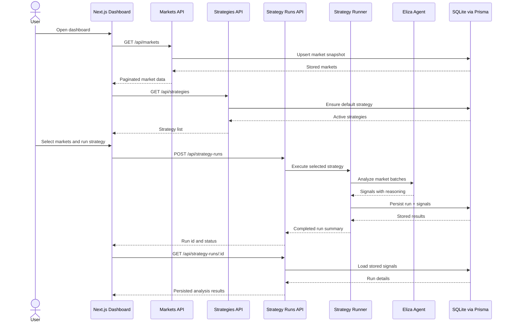

# Polymarket Intelligence Agent

Polymarket Intelligence Agent is a Next.js application for exploring live Polymarket markets, selecting the markets that matter, and running persisted AI analysis strategies against them. It is built as a Superteam submission and packaged to run cleanly inside Docker for Nosana-style deployments.

## What the app does

- Pulls live market data from the Polymarket Gamma API.
- Stores synced markets, strategy definitions, runs, and generated signals in SQLite via Prisma.
- Lets users select markets across filtered views and run a strategy on the selected set.
- Persists the full reasoning, action, confidence, and run metadata for later review.
- Shows market details, liquidity, and the most recent stored analysis in the dashboard.
- Falls back to deterministic mock analysis when the upstream AI service is unavailable.

## Features

- Signal Alpha Engine: Flags mispriced outcomes by comparing AI fair value against live market price.
- Deep Reasoning Logs: Persists structured reasoning sections (market context, sentiment analysis, final verdict) for auditability.
- Multi-Agent Personas: Toggle between Contrarian, Quant, News Junkie, and Balanced analyst modes.
- Nosana-Ready Architecture: Built for low-latency inference with resilient fallback handling when upstream inference is unavailable.

## Core workflow



## Stack

- Next.js App Router with React and TypeScript
- Prisma ORM with SQLite persistence
- ElizaOS API client for strategy execution
- Tailwind CSS and custom UI primitives
- Recharts for dashboard analytics
- Zod for input validation

## Environment

Copy `.env.example` to `.env` for local development.

```env
DATABASE_URL=file:./prisma/dev.db
ELIZA_AGENT_URL=http://localhost:3001
NEXT_PUBLIC_APP_NAME=Polymarket Intelligence Agent
POLYMARKET_MOCK_MODE=false
```

Notes:

- `DATABASE_URL` uses SQLite. Local development defaults to a file inside `prisma/`.
- Docker defaults to `file:/app/data/polymarket.db` so the database can live on a mounted volume.
- `POLYMARKET_MOCK_MODE=true` forces mock market and signal behavior for offline demos.

## Local setup

1. Install dependencies.

```bash
npm install
```

2. Generate the Prisma client.

```bash
npm run prisma:generate
```

3. Apply the local migration history.

```bash
npm run prisma:migrate -- --name init
```

4. Seed the local database with starter markets and the default strategy.

```bash
npm run prisma:seed
```

5. Start the development server.

```bash
npm run dev
```

6. Open `http://localhost:3000`.

## How to use the app

1. Open the dashboard and let the market sync finish.
2. Search or page through Polymarket markets.
3. Select one or more markets from the table.
4. Switch to the Strategies tab and choose a strategy.
5. Run the strategy on the selected markets.
6. Review stored signals, confidence, reasoning, and run history.
7. Click a market row to inspect liquidity, expiry, and the latest persisted summary.

## Docker deployment

The production container now does three things on startup:

1. Ensures the SQLite directory exists.
2. Runs `prisma migrate deploy`.
3. Starts the Next.js server on `0.0.0.0:3000`.

Build the image:

```bash
docker build -t polymarket-intelligence-agent .
```

Run the container directly:

```bash
docker run --rm \
  -p 3000:3000 \
  -e ELIZA_AGENT_URL=http://host.docker.internal:3001 \
  -e DATABASE_URL=file:/app/data/polymarket.db \
  -v polymarket_data:/app/data \
  polymarket-intelligence-agent
```

Run with Docker Compose:

```bash
docker compose up --build
```

Compose uses a named volume for SQLite persistence and maps `host.docker.internal` so the container can reach an Eliza service running on the host.

## Nosana deployment notes

For Nosana, use the Docker image produced from this repository as the job container that serves the Next.js app. The important runtime settings are:

- Expose port `3000`.
- Set `ELIZA_AGENT_URL` to the reachable Eliza endpoint for the job.
- Keep `DATABASE_URL=file:/app/data/polymarket.db` or another writable SQLite path.
- Mount a writable volume to `/app/data` if the job runtime supports persistence.

If the job environment is ephemeral, the app still works, but strategy runs and market history will be lost between executions.

### Demo persistence via baked SQLite snapshot

For demo-only deployments that always pull `latest`, the build workflow can embed `polymarket-intelligence-agent/prisma/prisma/dev.db` into the image.

1. Keep your desired demo data in `polymarket-intelligence-agent/prisma/prisma/dev.db`.
2. Run `Build and Push Docker Image` with `embed_demo_db=true` (default).
3. Deploy by pulling `pwilson99/nosana-eliza-agent:latest`.

This gives each fresh deployment the same starting demo dataset. Runtime changes are still ephemeral unless a writable volume is mounted.

### OpenRouter key in production without committing secrets

Use the existing build-and-publish workflow at `.github/workflows/docker-fullstack.yml` to inject the OpenRouter key at image build time via a BuildKit secret.

1. Add repository secret `OPENROUTER_API_KEY` in GitHub.
2. Run the `Build and Push Docker Image` workflow from the Actions tab (or push to `main`).
3. Optionally set `fallback_model` (default: `anthropic/claude-3-haiku`).
4. Deploy by pulling `pwilson99/nosana-eliza-agent:latest`; the built image already contains runtime defaults and an internal fallback key file for the LLM proxy.

This keeps `OPENROUTER_API_KEY` out of committed `.env` files and repository history, but note that any secret embedded in the image filesystem can still be extracted by someone with image access.

## Production commands

```bash
npm run build
npm run lint
npm run prisma:migrate:deploy
npm run start
```

## Repository highlights

- `app/dashboard/page.tsx`: dashboard, selection flow, and strategy execution UX.
- `app/api/markets/route.ts`: Polymarket sync plus DB upsert.
- `app/api/strategies/route.ts`: active strategies, including the default strategy.
- `app/api/strategy-runs/route.ts`: run execution and history listing.
- `lib/strategy-runner.ts`: strategy orchestration and signal persistence.
- `prisma/schema.prisma`: SQLite schema for markets, signals, strategies, and runs.

## Operational notes

- The app stores strategy results in SQLite, not just in memory.
- The default strategy is created automatically if it does not already exist.
- If Eliza is unavailable, mock analysis keeps the UI functional for demos and testing.
- Strategy scheduling fields exist in the data model, but automatic scheduled execution is not implemented yet.
